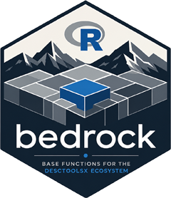

# 📦 bedrock 

<!-- badges: start -->
[](https://CRAN.R-project.org/package=bedrock)
[](https://github.com/AndriSignorell/bedrock/actions/workflows/R-CMD-check.yaml)
[](https://app.codecov.io/gh/AndriSignorell/bedrock)
[](https://CRAN.R-project.org/package=bedrock)
[](https://www.gnu.org/licenses/old-licenses/gpl-2.0.html)
<!-- badges: end -->

**Title:** Base Functions for the DescToolsX Ecosystem\
**License:** GPL (≥ 2)

## 🧩 Overview

`bedrock` is the foundation layer of the **DescToolsX ecosystem**. It
provides low-level, generic utilities and basic routines — data
manipulation, inspection, vector operations, string handling, math and
combinatorics — that serve as building blocks for the higher-level
statistical, graphics, and modelling packages of the suite.

The package is self-contained. It has no dependency on any other package
of the suite and is equally useful on its own.

It follows the DescToolsX design rules: a consistent lowerCamelCase API,
generic functions with S3 methods, predictable argument names and
ordering, and performance-critical routines implemented in Rcpp.

📖 **Documentation:** <https://andrisignorell.github.io/bedrock/>

## ⚙️ Installation

Install the released version from CRAN:

``` r
install.packages("bedrock")
```

Or the development version from GitHub:

``` r
remotes::install_github("AndriSignorell/bedrock")
```

## 📚 Core Features

### 🔹 Data Manipulation

Appending, recoding, renaming, sorting, and reshaping of vectors,
factors, matrices, and data frames.

-   `appendX()`, `appendRowNames()`, `appendEnum()`
-   `recodeX()`, `revCode()`, `combLevels()`, `dummy()`
-   `sortX()`, `revX()`, `renameX()`, `setNamesX()`
-   `splitX()`, `splitAt()`, `toLong()` / `toWide()`
-   `recycle()`, `columnWrap()`, `compareDataFrames()`
-   `toBaseR()`, `stringsAsFactors()`
-   Type coercion shortcuts: `num()`, `int()`, `chr()`, `nchr()`, `bin()`

### 🔹 Data Inspection & Validation

Predicates and checks for data quality and structure.

-   `isNumeric()`, `isDichotomous()`, `isLowCardinality()`,
    `isWholeLike()`, `isZero()`, `isNA()`
-   `allDuplicated()`, `allIdentical()`, `completeColumns()`,
    `countCompCases()`, `flags()`
-   Between operators: `%[]%`, `%()%`, `%[)%`, `%(]%`
-   `isFilePath()`, `isURL()`, `isEuclid()`

### 🔹 Vector Operations

-   `coalesceX()`, `closest()`, `locf()`
-   `naIf()`, `naReplace()`, `nz()`
-   `trim()`, `winsorize()`, `setLength()`
-   `moveAvg()`, `midx()`, `vRot()`, `vShift()`, `pairApply()`

### 🔹 String Utilities

-   `mGsub()`, `mReplace()`
-   `strSplitToCol()`, `strSplitToDummy()`
-   `charToAscii()` / `asciiToChar()`, `asCDateFmt()`

### 🔹 Mathematical Functions

-   `roundTo()`, `linScale()`, `logit()`
-   `nDec()`, `prec()`, `frac()`, `maxDigits()`
-   `rankX()`, `percentRank()`, `nUnique()`
-   `dotProd()`, `crossProd()`, `crossProdN()`
-   `unirootAll()`, `untable()`

### 🔹 Number Theory & Combinatorics

-   `primes()`, `isPrime()`, `factorize()`, `divisors()`
-   `GCD()` / `LCM()`, `fibonacci()`, `digitSum()`, `isOdd()`
-   Base conversions: `decToBin()`, `decToHex()`, `decToOct()`,
    `baseToBase()`, `romanToInt()`
-   `combN()`, `combSet()`, `combPairs()`, `permn()`
-   `sampleX()`, `randGroupSplit()`, `unwhich()`

### 🔹 Tables & Merging

-   `collapseTable()`, `multMerge()`, `printCharMatrix()`

### 🔹 Labels & Metadata

-   `label()` — get or set variable labels
-   `setAttr()`, `removeAttr()`, `keepAttr()`
-   `openDataObject()`, `dataDescription()` — Excel data with codes
    and labels

### 🔹 File Utilities

-   `buildPath()`, `splitPath()`
-   `findDownload()`, `readDownload()`, `peekFile()`
-   `fileExistURL()`, `pdfManual()`
-   `parseSASDatalines()` — parse SAS DATALINES blocks into a
    data.frame

### 🔹 Programming & Introspection

-   `callIf()`, `mergeArgs()`, `extractArgs()`, `getDotsArg()`, `quot()`
-   `resolveFormula()`, `resolveGroups()`, `resolveContingency()`
-   `funArgs()`, `funCalls()`, `funList()`, `funKeywords()`
-   `rdTitle()`, `rdLabels()`, `strX()`

### 🔹 Datasets

Teaching and example datasets: `Cards`, `Pizza`, `Roulette`, `Tarot`,
plus `courseData()` for loading course material.

## 🚀 Design Principles

-   **Consistent** — lowerCamelCase API and uniform argument
    conventions across the whole DescToolsX suite
-   **Fast** — performance-critical routines implemented in Rcpp
-   **Generic** — S3 generics with methods for vectors, factors,
    matrices, tables, and data frames
-   **Robust** — validated inputs, informative errors, extensive
    testthat coverage

## 🧪 Example

``` r
library(bedrock)

# range operators
x <- 1:10
x %[]% c(3, 6)

# first non-missing value
coalesceX(c(NA, NA, 5, 3))

# round to arbitrary multiples
roundTo(c(1.23, 4.56), 0.25)

# all 2-element subsets
combSet(letters[1:4], 2)

# parse a SAS data step
sas <- "
  data mydata;
    input name $ age score;
  datalines;
  Alice 30 95.5
  Bob   25 88.0
  ;
"
parseSASDatalines(sas)
```

## 🙏 Acknowledgements

Parts of the code and documentation were reviewed with the help of large
language models (OpenAI Codex, Anthropic Claude). Every suggestion was
assessed, edited and verified by the maintainer, who remains solely
responsible for the content of this package.

## 📜 License

GPL (≥ 2)
